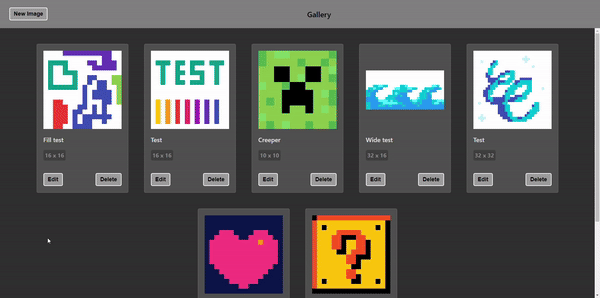
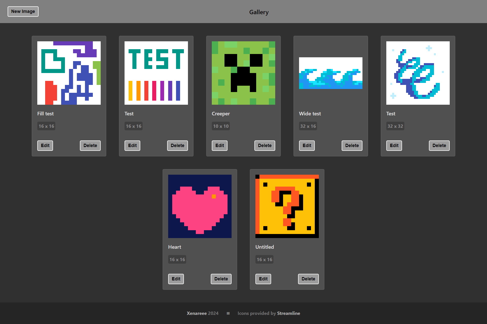
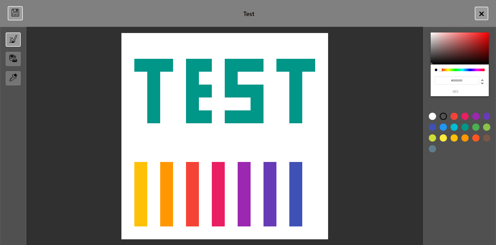
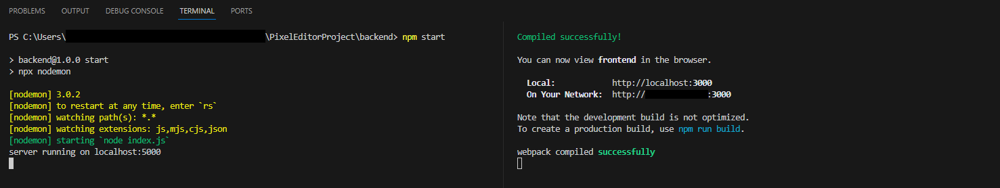

> [!NOTE]
> ### 🎓 This is a student project which won't be further updated.
> > **Finished:** `01.2024`
>
> This repository is read-only and works as an archive for this project.
>
> Despite this, downloading the files and running the application is encouraged. I would be happy if this project ended up as help or inspiration.
<br/>

#  Pixel Editor

A simple web application for creating pixel art, made using the React library.

<br/>
<p align="center">
<br/>
<i><sub>using the app</sub></i>
</p>
<br/>

If connected to a database, the gallery displays all saved images and their details. Images can be edited or deleted via a button on their card, and saved to the database from the editor.

The editor has 3 tools: the **brush**, **fill bucket**, and **eyedropper**, as well as color pickers.

<br/>
<p align="center">
 <br/>
<i><sub>gallery and editor</sub></i>
</p>

<br/>

## 🛠 Setup

1. Clone this repository.

2. Prepare two terminals:
   - type `cd frontend` in first;
   - type `cd backend` in second.

3. Type `npm install` in both terminals to install the dependencies.

4. *<u>( This step is optional. )</u>* If you have a database to connect with this application, perform these steps:
   - Create an `.env` file in the `backend` folder:
    ```env
    DATABASE_URL=<YOUR DATABASE URL HERE>
    ```
   - Depending on the database you might need to change the `schema.prisma` file or re-generate it again using the `prisma init` command (please copy over the Image model, as that's not generated). This project was originally made with an [ElephantSQL](https://www.elephantsql.com/) database.

> **Note:** Omitting this step means you will not be using a database, which makes the `backend` part of the project unusable. If you omitted step 4, please ignore further instructions for the `backend` folder.
> 
> The application will fail to connect to the database, but will otherwise function normally and allow to create and edit images. Naturally, saving images will not work.

5. Type `npm start` in both terminals to boot the application.

6. The app is now accessible on http://localhost:3000/

<br/>
<p align="center">
<br/>
<i><sub>successfully booting the app</sub></i>
</p>

<br/>

## 🔗 References

Most impactful tutorials and tools used while creating the project.

- [Streamline](https://www.streamlinehq.com/icons/pixel) - pixel icons.
- [React Color](https://casesandberg.github.io/react-color/) - library used for color picker React components.

---

- <kbd>YouTube Tutorial</kbd> [Full Stack React Node Project](https://www.youtube.com/watch?v=2MoSzSlAuNk) - guided connecting a database via a REST API using prisma.
- <kbd>YouTube Tutorial</kbd> [Pixel Art Drawing App in React](https://www.youtube.com/watch?v=IAD68la3An8&) - inspired the approach behind a component-based canvas, although with no drag support which was added by myself.
- <kbd>Medium</kbd> [Understanding and Implementing Flood Fill Algorithm](https://medium.com/@koray.kara98.kk/understanding-and-implementing-flood-fill-algorithm-60ab81538d54) - helped understand the flood fill algorithm used in the fill tool.

<br/>
